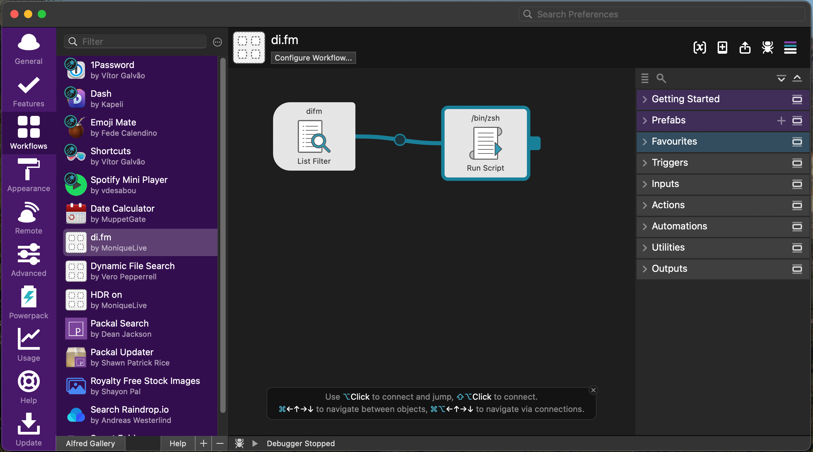
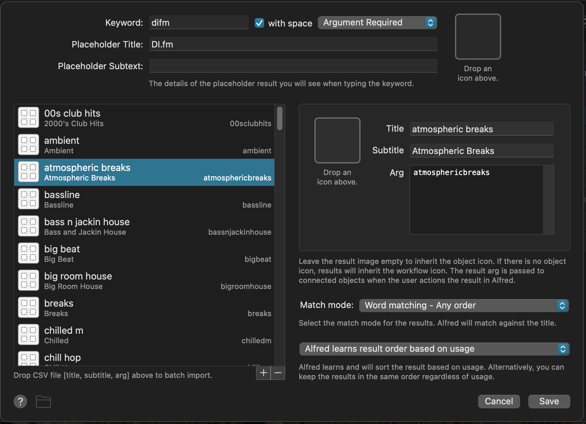
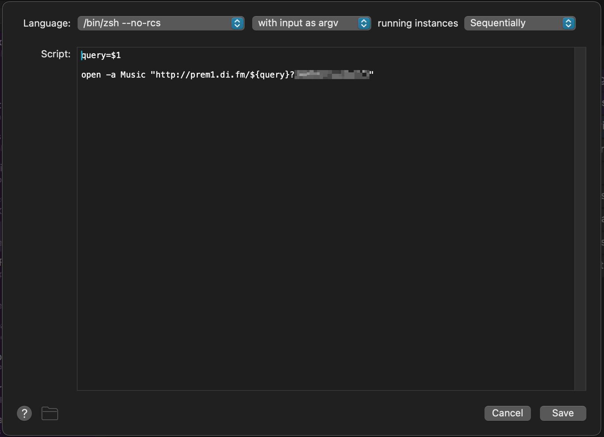
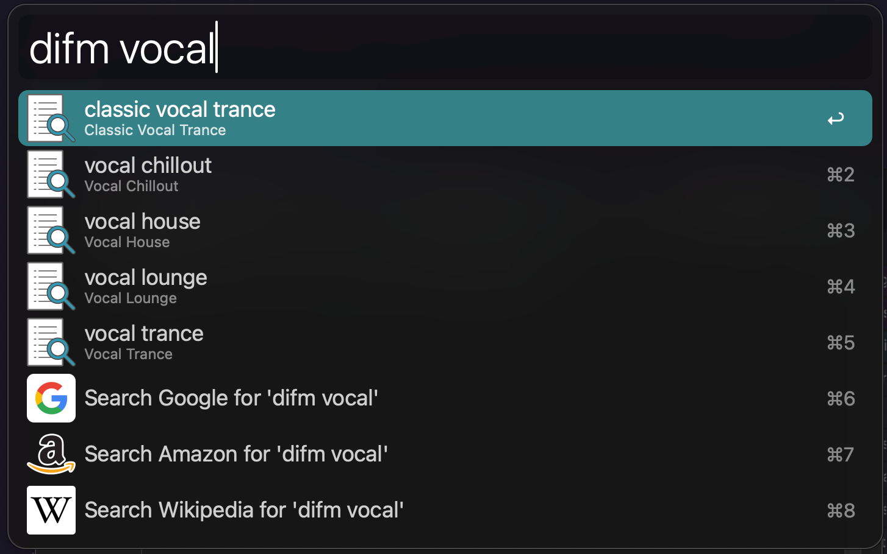

## Resumo
Como automatizei no Alfred a troca de estações da Digitally Imported, gerando a lista via GPT-4 e ligando tudo no Apple Music.

Um workflow customizado para escolher músicas da [Digitally Imported](https://di.fm)

## O problema

Se você é um fã de EDM como eu, provavelmente conhece o super tradicional site [Digitally Imported](https://di.fm).

Sou apoiadora de longa data (e recomendo que você considere apoiar - as contas de streaming não são baratas, sabe). Mas uma coisa me incomodou por muito tempo: não tem um player nativo como Spotify e Apple Music. E eu gosto de mudar de estação o dia todo. E não gosto de manter uma aba do navegador exclusivamente para isso.

Como sou também usuária frequente do Alfred, procurei um workflow, mas não tive sorte. Então, fiz um.

## A solução
O editor de workflows é bem legal. Você arrasta caixas e as conecta para que a saída de uma caixa se torne a entrada da outra:


*Painel de Workflow do Meu Alfred*

E é isso. Apenas duas caixas conectadas para tocar um pouco de música eletrônica ❤️

## Mas espera, tem mais!
Seria um artigo muito chato se terminasse aqui, certo? 😊

Primeiro de tudo, a lista de estações de rádio é enorme! (99):


*duplo clique em List Filter*

Eu nunca digitaria 99 vezes cada informação da estação... Não... Pedi ajuda ao nosso amigável soberano **GPT-4**.

## Chat GPT ao resgate
Tudo o que eu tinha eram os 99 [slugs](https://pt.wikipedia.org/wiki/Slug_(programação)) das estações de rádio. Quando você abre uma playlist (.pls), você obtém todas as URLs de streaming no formato:

`http://prem1.di.fm/${query}?XXXXXX`

Onde `${query}` é o nome da estação e `XXXX` é a sua 'chave de escuta' que pode ser obtida na página de [Configurações](https://www.di.fm/settings).

Mas para preencher o *List Filter* do workflow, eu precisava de um arquivo .csv com 3 colunas:
1. Primeiramente palavras, separadas por espaço, que são pesquisadas após digitar a palavra-chave do seu workflow
2. Uma descrição em inglês em texto simples que será mostrada como um subtítulo
3. O valor que será passado como entrada para o próximo nó no grafo

Então, o prompt que escrevi foi basicamente:

```markdown
Dado os seguintes slugs:

- 00sclubhits
- ambient
- atmosphericbreaks
... (até 99)

Crie uma lista formatada em CSV de três colunas com:

- o slug quebrado em palavras
- uma descrição simples em inglês do slug
- o slug inalterado

Por exemplo:

- 00sclubhits

em CSV:

00s club hits, 2000's Club Hits, 00sclubhits
```

E ele gentilmente gerou [este arquivo csv](https://gist.github.com/moniquelive/bee80daafd5fb6658e8f3baa5419df57). ❤️ (100% transparente: eu removi a linha de cabeçalho e eliminei espaços extras entre colunas que confundiam o Alfred)

Depois, arrastei o arquivo .csv gerado para a coluna esquerda do *List Filter* e isso foi tudo para esse nó.

O segundo nó é super simples. É um nó *Run Script* com o seguinte:


*Abrindo o Apple Music com a seguinte URL*

Você pode usar o player de sua preferência aqui. Eu testei com VLC e Apple Music.

## E é isso!

Agora você tem um seletor de estações personalizado:


*Todas as estações vocais*

Espero que você tenha gostado de ler isso tanto quanto eu gostei de montar.

Tenha um bom dia!

_

= M =
