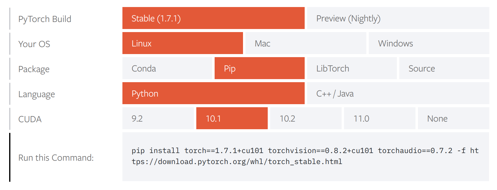

## Resumo
Como usar o repo `torch_stable` do PyTorch para instalar versões antigas ou específicas direto pelo pip.

## Encontrando versões no pip
Acabo de descobrir um repositório que salvou minha pele, então resolvi vir aqui compartilhar com vocês.

Se você abrir o site do `pytorch`, ele te apresenta algumas opções de instalação:



A questão é que, se você quiser instalar uma versão diferente da apresentada (hoje é a 1.7.1), vai começar uma caça ao tesouro bem chatinha...

Existe uma página - que sei lá o porquê me levou um tempo pra achar - aqui:

```shell
https://download.pytorch.org/whl/torch_stable.html
```

Mas não é necessário abrir esse link! Você pode pedir ao `pip` pra buscar pra você:

```shell
python3 -m pip install "torch==1.6.0+cu101" \
  --find-links https://download.pytorch.org/whl/torch_stable.html
```

E voilá, seu pacote vai ser instalado automagicamente ;)

## Dicas extras
Algumas dicas extras:

1. Para instalar a variante CPU-only da mesma versão:

```shell
python3 -m pip install "torch==1.6.0+cpu" \
  --find-links https://download.pytorch.org/whl/torch_stable.html
```

2. Para salvar esse repositório no seu `requirements.txt`, adicione:

```text
--find-links https://download.pytorch.org/whl/torch_stable.html
torch==1.6.0+cu101
```

Essas versões são históricas. O wheel precisa ser compatível com sua versão do Python, sistema operacional e arquitetura; instalações modernas podem não ter uma combinação compatível.

Happy torching!
